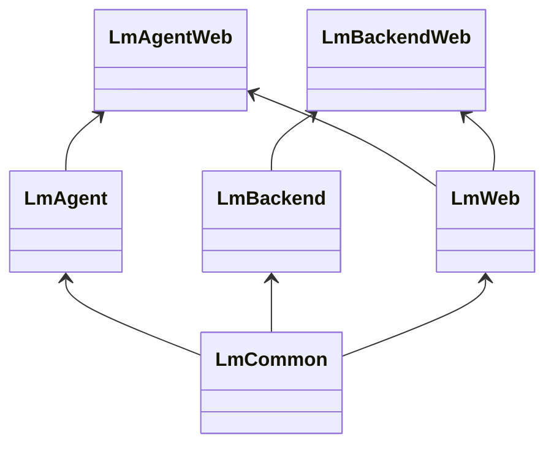

# Local Metrics

This was an experiment to run metrics in a distributed way: local collection and
access, with optional aggregation through a hosted backend.

## Layout

We have constructed this - for now - as an umbrella application with the
following apps:

* [apps/lm_agent_web](apps/lm_agent_web): the agent application, which users install. It is
  fully stand-alone.
* [apps/lm_backend_web](apps/lm_backend_web): "our" backend, which agents can optionally
  connect to for data aggregation, replication coordination, and so on.
* [apps/lm_agent](apps/lm_agent): agent-specific code (local storage, sending to backend, etc)
* [apps/lm_backend](apps/lm_backend): backend-specific code (PostgreSQL storage, etc)
* [apps/lm_web](apps/lm_web): common code for front-ends (Phoenix deps, etc).
* [apps/lm_common](apps/lm_common): code common to both.

Modelled as a class diagram we get the following dependencies:

We build deployables for `lm_agent_web` and `lm_backend_web`. The included Dockerfile will
build the latter by default but `--build-arg SUBSYSTEM=agent` will build the agent
container.
